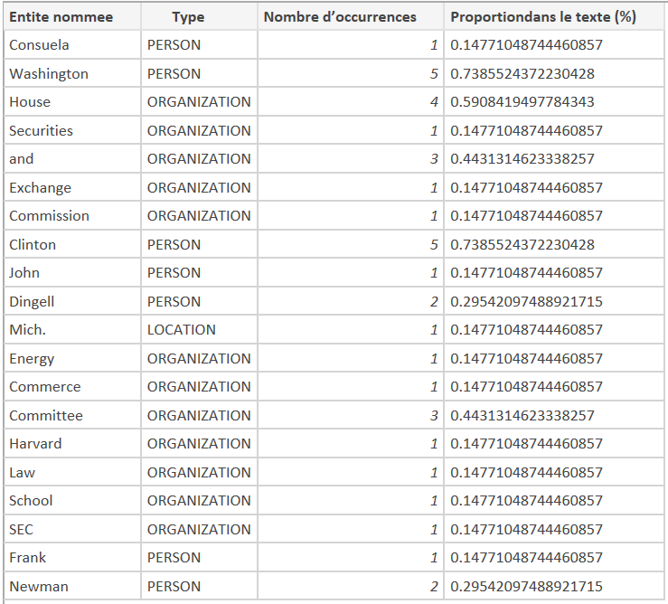

# TP2

## Téléchargement de stanford-postagger-2018-10-16.zip
Disponible sur : https://nlp.stanford.edu/software/tagger.shtml


## Partie 1 : Evaluation
### Question a
```
cd stanford-postagger-full-2018-10-16/
./stanford-postagger.sh models/english-left3words-distsim.tagger ../wsj_0010_sample.txt > ../wsj_0010_sample.txt.pos.stanford
```

### Question b
```
python from_ref_to_stanford_pos_tagger.py wsj_0010_sample.pos.ref wsj_0010_sample.pos.stanford.ref
```
### Question c
```
python evaluate.py wsj_0010_sample.txt.pos.stanford wsj_0010_sample.pos.stanford.ref
```

Résultats obtenus : 

```
Word precision: 0.9636363636363636
Word recall: 0.9464285714285714
Tag precision: 0.9454545454545454
Tag recall: 0.9285714285714286
Word F-measure: 0.9549549549549549
Tag F-measure: 0.9369369369369368
```

### Question d
```
python from_PTB_to_universal.py wsj_0010_sample.txt.pos.stanford wsj_0010_sample.pos.stanford.ref POSTags_PTB_Universal.txt wsj_0010_sample.txt.pos.univ.stanford wsj_0010_sample.txt.pos.univ.ref
```
Avec *wsj_0010_sample.txt.pos.stanford* : premier fichier à convertir
*wsj_0010_sample.pos.stanford.ref* : deuxième fichier à convertir
*POSTags_PTB_Universal.txt* : le dictionnaire
*wsj_0010_sample.txt.pos.univ.stanford* : le fichier résultat de *wsj_0010_sample.txt.pos.stanford*

*wsj_0010_sample.txt.pos.univ.ref* : le fichier résultat de *wsj_0010_sample.pos.stanford.ref*


### Question e
```
python evaluate.py wsj_0010_sample.txt.pos.univ.stanford wsj_0010_sample.txt.pos.univ.ref
```

Résultats obtenus
```
Word precision: 0.990909090909091
Word recall: 0.990909090909091
Tag precision: 0.9727272727272728
Tag recall: 0.9727272727272728
Word F-measure: 0.990909090909091
Tag F-measure: 0.9727272727272728
```

### Question f

Nous observons de meilleurs résultats sur les fichiers contenant des étiquettes universelles. Cela est dû à un nombre d'étiquettes moins important et donc une meilleure précision.


## Partie 2 : Evaluation

### Question a
```
java -mx600m -cp stanford-ner.jar:lib/* edu.stanford.nlp.ie.crf.CRFClassifier -loadClassifier classifiers/english.all.3class.distsim.crf.ser.gz -textFile formal-tst.NE.key.04oct95_small.txt > formal-tst.NE.key.04oct95_small.txt.ne.stanford
```

### Question b
```
python from_file_to_ne.py .\formaltst.NE.key.04oct95_small.txt.ne.stanford .\formaltst.NE.key.04oct95_small.txt.ne.stanford
```

Résultats obtenus : 
